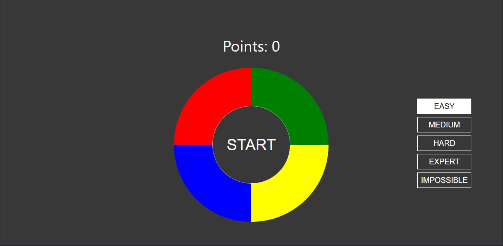

> This project was bootstrapped with [Create React App](https://github.com/facebookincubator/create-react-app).

# React Simon Says



This is my first pet-project using React. 
>Difficulty levels have been added to the game for more variety. 
Try them all :fire:

Use all your mind force for make some fun :smiley:

You can play it [here](https://skyland891.github.io/simon-game/)

### Using libraries

The app was styled with [styled-components](https://styled-components.com/)

### Quick Start

```
$ git clone https://github.com/skyland891/simon-game.git
$ cd simon-game
$ npm install
$ npm start
```
### Contributing

Changes and improvements are more than welcome! Feel free to fork and open a pull request. Please make your changes in a specific branch and request to pull into master! 